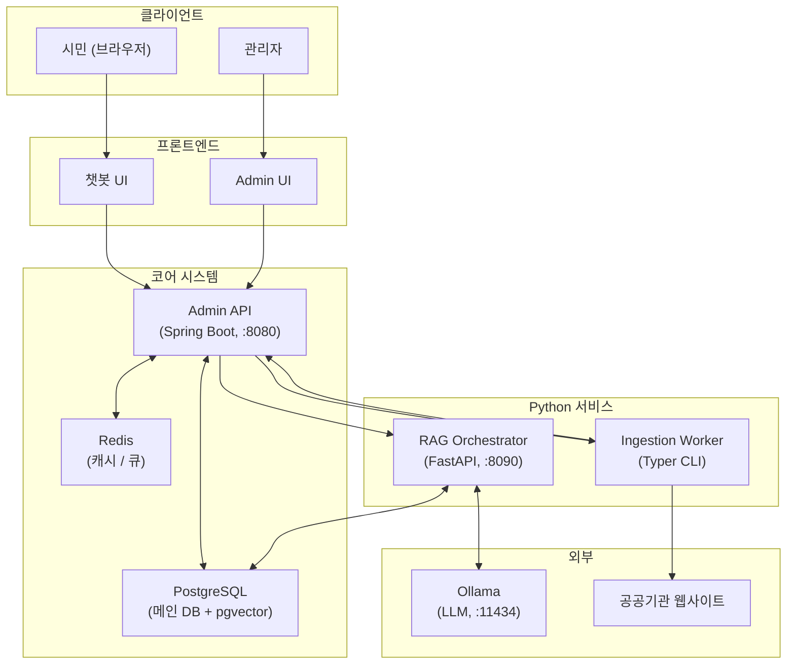
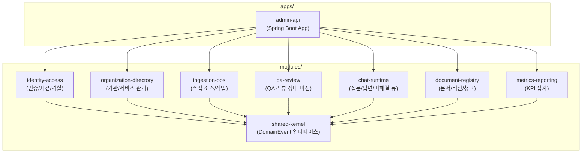
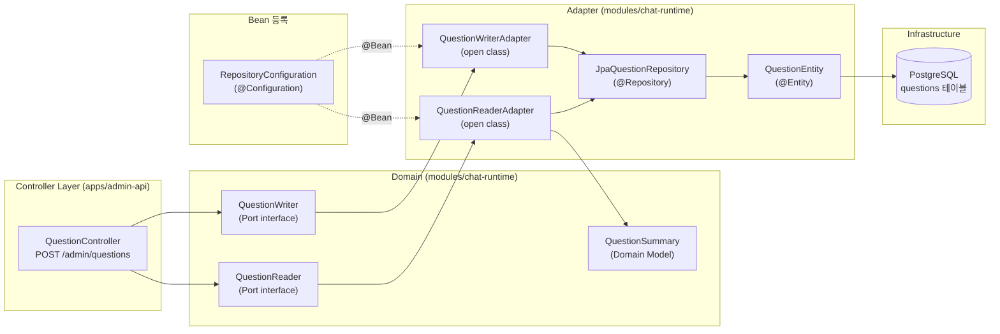
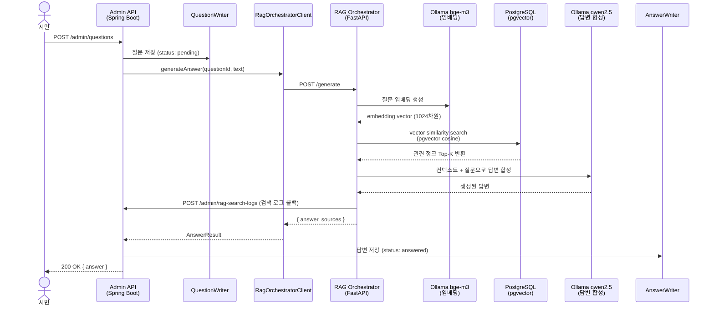
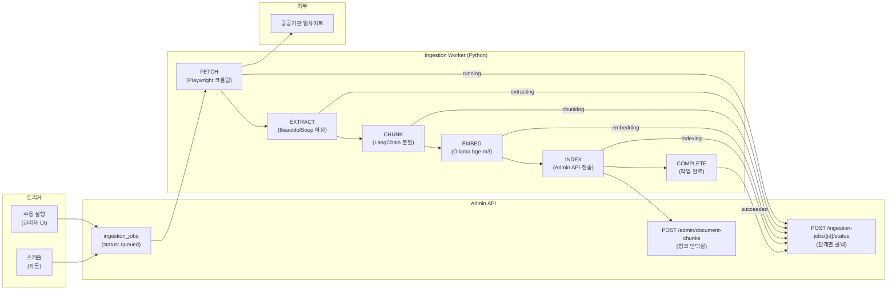
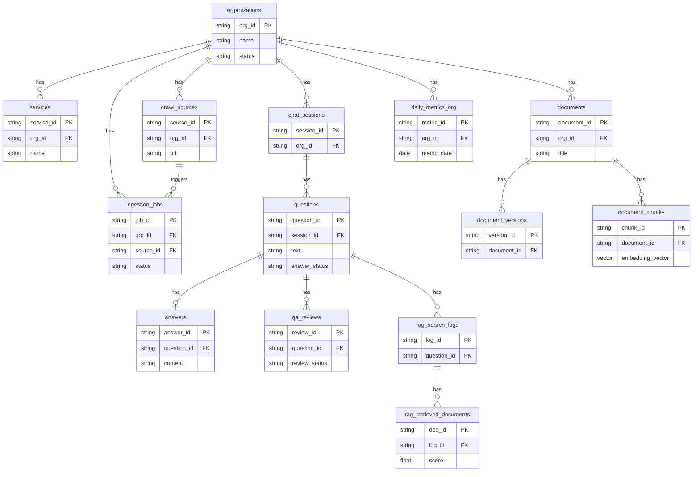
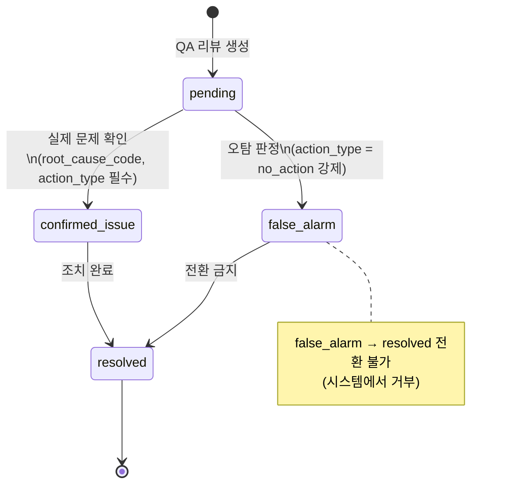
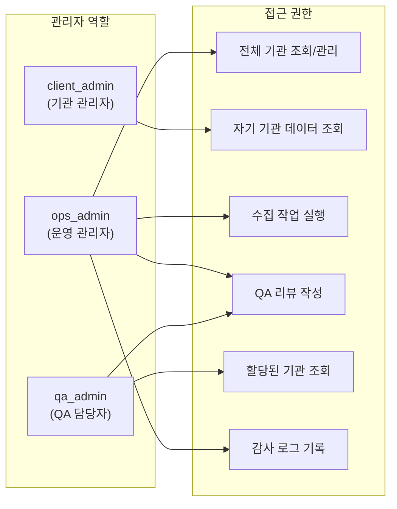

# centras-ai-gov 아키텍처 문서

이 문서는 centras-ai-gov 시스템의 전체 구조, 데이터 흐름, 도메인 경계를 시각화한다.

---

## 1. 시스템 전체 구조

전체 시스템은 Spring Boot Admin API를 중심으로, Python 워커와 RAG 오케스트레이터가 외부 워커로 연결된 하이브리드 아키텍처다.

**핵심 포인트**
- Admin API(Spring Boot)가 모든 운영 상태의 System of Record
- RAG Orchestrator와 Ingestion Worker는 Python 워커로 Admin API에 콜백
- pgvector가 PostgreSQL 내에 통합되어 별도 벡터 DB 불필요

---

## 2. Gradle 모듈 의존성

`apps/admin-api`가 모든 도메인 모듈을 통합하고, 각 모듈은 `shared-kernel`에만 의존한다.

**핵심 포인트**
- 모듈 간 직접 의존 없음 — 순환 의존 방지
- 모듈 경계를 넘는 조회는 native SQL 또는 Admin API 경유
- `shared-kernel`은 `DomainEvent` 인터페이스만 포함

---

## 3. 헥사고날 아키텍처 패턴

모든 도메인 모듈은 포트-어댑터 패턴을 따른다. `chat-runtime` 모듈을 예시로 표현한다.

**핵심 포인트**
- 어댑터는 `@Component` 없이 `RepositoryConfiguration`에서 명시적 `@Bean` 등록
- 어댑터는 반드시 `open class` — Spring CGLIB 프록시 지원
- Controller는 도메인 모델(Port)만 알고, JPA 엔티티를 직접 참조하지 않음

---

## 4. 시민 질문 → 답변 생성 흐름

시민이 질문을 입력하면 RAG 파이프라인을 거쳐 답변이 생성되고 DB에 저장되는 전체 흐름이다.

**핵심 포인트**
- 답변 합성은 RAG Orchestrator에서 완결 — Admin API는 결과만 수신
- 검색 로그(`rag_search_logs`, `rag_retrieved_documents`)는 콜백으로 Admin API에 저장
- 답변 생성 실패 시 `answer_status = fallback` 또는 `no_answer`로 저장

---

## 5. 문서 수집 파이프라인 (Ingestion Worker)

관리자가 수집을 트리거하면 Python 워커가 단계별로 문서를 처리하고 Admin API에 콜백한다.

**핵심 포인트**
- 각 단계마다 `POST /ingestion-jobs/{id}/status` 콜백으로 진행 상태 기록
- Worker는 Playwright로 JavaScript 렌더링 페이지까지 크롤링
- 임베딩 벡터(1024차원)는 `document_chunks.embedding_vector`에 저장

---

## 6. DB 스키마 관계

15개 핵심 테이블의 관계를 bounded context 단위로 표현한다.

**핵심 포인트**
- 모든 비즈니스 테이블은 `org_id`로 조직 스코프 적용
- `document_chunks.embedding_vector`는 H2(테스트)에서 TEXT, PostgreSQL에서 `vector(1024)`
- V018 Flyway 마이그레이션은 PostgreSQL 전용 (H2 테스트는 `flyway.target=17`로 스킵)

---

## 7. QA 리뷰 상태 머신

미해결 답변에 대해 운영자가 수행하는 QA 리뷰의 상태 전이를 나타낸다.

**핵심 포인트**
- `confirmed_issue` 전환 시 `root_cause_code`와 `action_type` 필드 필수
- `false_alarm`은 반드시 `action_type = no_action`으로 저장
- `false_alarm → resolved` 전환은 도메인 규칙으로 금지

---

## 8. 역할별 접근 권한

세 가지 관리자 역할이 접근할 수 있는 범위와 기능을 정의한다.

**핵심 포인트**
- 권한은 화면 단위가 아닌 **액션 단위**로 적용
- 모든 요청은 세션에서 `user_id`, `role_code`, `organization_scope`를 복원
- 스코프 밖 리소스 접근: 권한 없음 → `403`, 스코프 밖 리소스 → `404`

---

## 참고 문서

| 문서 | 내용 |
|---|---|
| `mvp_docs/04_data_api.md` | 전체 테이블 스키마, API 계약 |
| `mvp_docs/05_architecture_openrag.md` | 모듈러 모노리스 아키텍처 결정 |
| `mvp_docs/06_access_policy.md` | 역할별 화면 접근 정책 |
| `mvp_docs/09_unresolved_qa_state_machine.md` | 미해결 큐 가시성 규칙 |
| `mvp_docs/10_auth_authz_api.md` | 인증 API, 세션 라이프사이클 |
