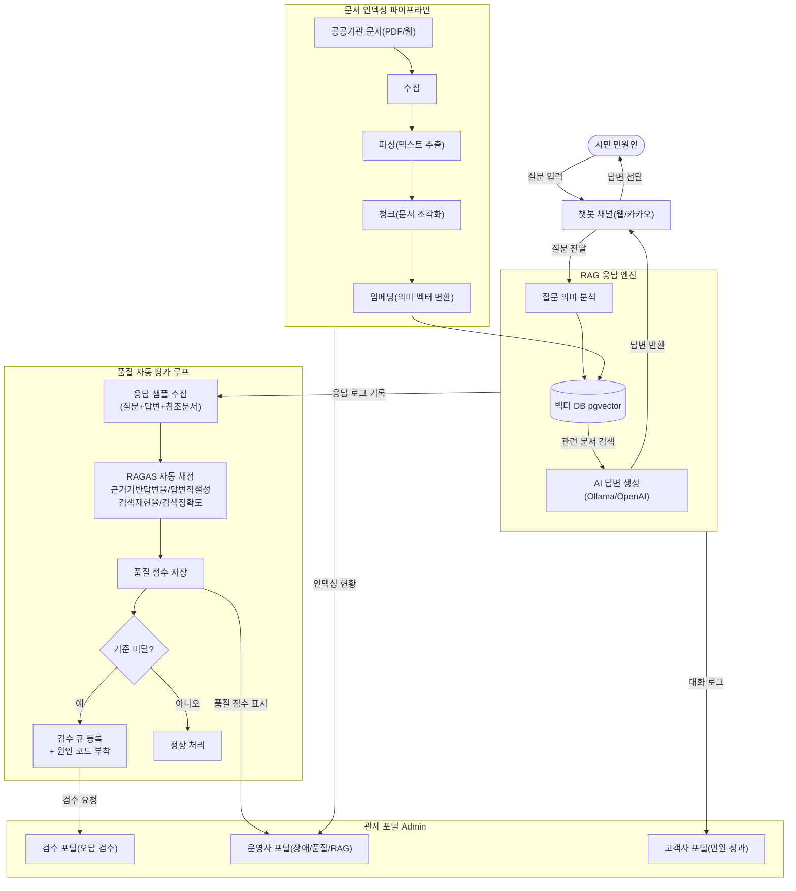
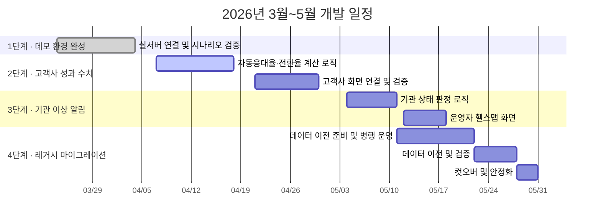
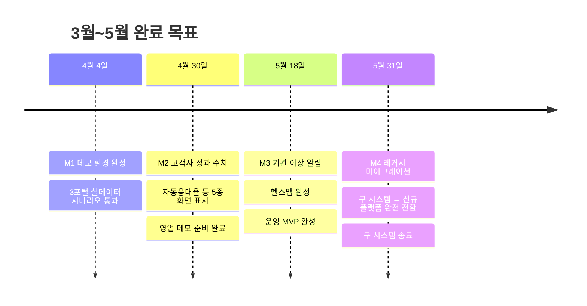

# 공공기관 RAG 챗봇 운영 플랫폼 — 개발 현황 및 4월 액션 플랜

> 기준일: 2026-03-24

---

## 제품 개요

공공기관 민원 챗봇을 통합 관제하는 플랫폼.
**운영사(JCG)** 는 장애·품질을 모니터링하고, **고객사(공공기관)** 는 민원 성과를 확인한다.
화면 뼈대는 완성됐고, 5월 말까지 핵심 수치 연결·기관 이상 알림 완성 및 기존 시스템 마이그레이션을 완료한다.

---

## 전체 파이프라인 구조도

### 시스템 전체 흐름

### 파이프라인 단계별 역할

| 단계 | 역할 | 담당 시스템 |
|------|------|-------------|
| ① 수집 | 공공기관 웹사이트·문서 자동 수집 | 수집 워커 |
| ② 파싱 | PDF·한글·표에서 텍스트 추출 | 수집 워커 |
| ③ 청크 | 긴 문서를 검색 가능한 작은 단위로 분할 | 수집 워커 |
| ④ 임베딩 | 텍스트를 의미 벡터로 변환 | AI 모델 (Ollama) |
| ⑤ 인덱싱 | 벡터 DB에 저장 → 검색 가능 상태 | PostgreSQL (pgvector) |
| ⑥ 검색 | 질문과 유사한 문서 청크 검색 | RAG 오케스트레이터 |
| ⑦ 답변 생성 | 검색된 문서를 근거로 AI 답변 작성 | LLM (Ollama / OpenAI) |
| ⑧ 품질 측정 | 답변 충실도·관련성 자동 채점 | RAGAS 평가 엔진 |

---

## 기존 시스템 대비 무엇이 달라지나

기존에 운영 중인 `centras-ai-server`와 비교한 핵심 개선 포인트.

| 항목 | 기존 시스템 | 이번 플랫폼 | 의미 |
|------|-------------|-------------|------|
| 관제 화면 | 없음 (로그 파일만 확인) | 운영사: 기관별 헬스맵·이상탐지·RAG 파이프라인 현황 / 고객사: 자동응대율·상담전환율·재문의율 성과 KPI / 검수: 미응답·오답·저만족 응답 검수 큐 | 장애 발생 시 즉시 인지, 기관별 현황 한눈에 파악 |
| 품질 측정 | 좋아요/나빠요만 | 근거 기반 답변율·답변 적절성·검색 정확도·검색 재현율 4종을 AI가 자동 산출, 사람 개입 없이 정기 회귀 테스트 가능 | 품질 하락을 사람이 보지 않아도 자동 감지 |
| 실패 원인 분류 | 없음 | A01(문서 없음)~A10(채널 UI 문제) 10가지 코드로 분류, 운영사 조치 6종·고객사 조치 3종·협의 1종으로 책임 명확화 | "이건 고객사가 문서 추가해야 함" vs "이건 우리가 고쳐야 함" 즉시 구분 |
| 고객사 접근 | 운영사·고객사 공동 접근 (역할 구분 없음) | 고객사 관리자: 자기 기관 성과·지식 현황 자립 조회 / 고객사 열람자: 리포트 다운로드 전용 / 지식 편집자: 문서 업로드·FAQ 작성 (승인 없이 배포 불가) | 고객사 자립 운영, 보고 공수 절감 |
| 역할 체계 | 3단계 (관리자/담당자/일반) | 업무 단위로 6개 역할 분리 — 운영·품질검수·기관관리·조회·문서편집 등 맡은 일만 볼 수 있음 | 권한 오용 차단, 고객사 정보 교차 노출 방지 |
| AI 인프라 | OpenAI·Groq 외부 API 의존 | 내부 서버 AI 모델(Ollama) 지원으로 폐쇄망 공공기관 대응 가능, 필요 시 OpenAI 혼용도 지원 | 보안 민감 기관 수주 가능, 외부 API 장애 영향 차단 |
| 서버 구성 | 데이터 DB(MySQL) + 벡터 검색(Elasticsearch) 이원화 | PostgreSQL 단일 DB에 벡터 검색 내장(pgvector), 일반 데이터와 의미 검색을 같은 서버에서 처리 | 벡터 검색 서버 별도 운영 불필요, 인프라 비용·장애 포인트 축소 |
| 비용 추적 | 없음 | 기관·서비스별 토큰 사용량·질문당 비용·응답시간 전수 기록 | 기관별 원가 계산, 요금제 설계 및 청구 근거 확보 |

---

## 현재 상태

### 운영사 포털

| 기능 | 상태 | 세부 내용 |
|------|:----:|-----------|
| 기관 전체 현황 대시보드 | 완료 | 총 질문 수·응답 성공률·평균 응답시간·장애 건수·지식 공백 KPI 카드 5종, 수집→파싱→청크→임베딩→인덱싱 5단계 진행률 표시 |
| 문서 수집·인덱싱 현황 | 완료 | 기관별 총 문서 수·인덱싱 성공률·파싱 실패 건수 표시, 수집 작업 목록·상태 전이 관리 |
| AI 품질 자동 채점 | 완료 | 근거 기반 답변율·답변 적절성·검색 재현율·검색 정확도 4종 스코어카드 자동 산출 및 이력 저장 |
| 비용·사용량 현황 | 완료 | 기관별 토큰 사용량·질문당 AI 비용·평균 응답시간 기록, 지식 공백 발생 건수 표시 |
| 미응답·오답 품질 모니터링 | 완료 | 미응답·오답의심·저평가 응답 목록, 실패 코드 A01~A10 원인 분류 및 조치 주체 표시 |
| 기관별 상태 알림 (헬스맵) | 미착수 | 기관별 미응답률·오류율 기반 정상/주의/위험 판정 로직 및 화면 — 5월 중 완성 목표 |

### 고객사 포털

| 기능 | 상태 | 세부 내용 |
|------|:----:|-----------|
| 기관 성과 대시보드 | 완료 | 총 문의 수·자동응대율·상담전환율·재문의율·업무시간 외 응대율 KPI 카드 배치 완료 (수치 계산 로직은 진행 중) |
| 민원응대 성과 페이지 | 완료 | 민원 유형별 해결률 화면 구조 완성 (실데이터 연결 진행 중) |
| 실패·상담전환 분석 | 완료 | 상담 전환 다발 질문·미응답 질문 목록, A01~A10 원인 설명·조치 주체 표시 완료 |
| 지식 현황 페이지 | 완료 | 문서 목록·인덱싱 상태·최신화 필요 문서 화면 구조 완성 |
| 성과 수치 5종 실데이터 연결 | 진행 중 | 자동응대율·상담전환율·재문의율·업무시간 외 응대율·지식 공백 수 — 집계 계산 로직 개발 중, 4월 말 완성 목표 |

### 검수(QA) 포털

| 기능 | 상태 | 세부 내용 |
|------|:----:|-----------|
| 검수 대시보드 | 완료 | 미응답 질문 수·오답 의심 수·저만족 응답 수 KPI 3종, 최근 검수 처리 이력 목록 |
| 미응답·오답 관리 | 완료 | 실패 질문 목록·원인코드(A01~A10) 분류·검수 상태(미처리→이슈확인→해결) 전이 관리 |
| 문서·FAQ 관리 | 완료 | 문서 업로드·FAQ 작성 화면, 문서 버전 이력 조회 |
| 승인 워크플로우 | 부분완료 | 화면 구조 존재, 문서 수정→검수→승인→반영 단계별 자동 전이 로직 미완 |
| 유사 질문 클러스터링 | 미착수 | 반복 민원 자동 그룹화 기능 — Q3 이후 검토 |

### 백엔드·인프라

| 기능 | 상태 | 세부 내용 |
|------|:----:|-----------|
| 인증·세션·감사 로그 | 완료 | 6개 역할 기반 로그인·세션 관리, 고위험 작업 감사 기록 |
| 기관·서비스 관리 | 완료 | 멀티테넌트 기관 등록·서비스 설정 API, 역할별 데이터 스코프 격리 |
| 문서 수집·인덱싱 파이프라인 | 진행 중 | 수집→파싱→청크→임베딩→벡터 저장 전 단계 개발 완료, 실서버 안정성 검증 중 |
| QA 리뷰 상태 머신 | 완료 | 미처리→이슈확인→해결 / 미처리→오탐 상태 전이 규칙 및 API 완료 |
| 실서버 E2E 검증 | 진행 중 | PostgreSQL 실서버 환경에서 전체 파이프라인 + 3포털 시나리오 검증 중 |
| 기관 이상탐지 API | 미착수 | 기관별 지표 집계 및 정상/주의/위험 판정 API — 5월 중 완성 목표 |

---

## 개발 일정 (3월~5월)

---

## 마일스톤별 액션 아이템

### M1 — 데모 환경 완성 (4월 4일까지)

목표: 3개 포털에서 실제 데이터로 시나리오 시연 가능

| # | 할 일 | 담당 | 완료 기준 |
|---|-------|------|-----------|
| 1 | 운영 서버 최초 연결 및 데이터 초기화 | 개발 | 서버 정상 기동 확인 |
| 2 | 샘플 민원 질문 20건 시스템 투입 | 개발 | 질문·답변 로그 적재 확인 |
| 3 | AI 품질 자동 채점 실행 | 개발 | 품질 점수 수치 화면 표시 |
| 4 | 운영자 화면 시나리오 점검 | 개발+QA | 5가지 시나리오 전부 통과 |
| 5 | 고객사·검수 화면 시나리오 점검 | 개발+QA | 화면별 수치 이상 없음 확인 |

---

### M2 — 고객사 성과 수치 연결 (4월 30일까지)

목표: 고객사 대시보드에서 실제 성과 수치 5종 표시 → 영업 제안서 활용 가능

| # | 할 일 | 담당 | 완료 기준 |
|---|-------|------|-----------|
| 1 | 자동응대율 계산 로직 개발 (챗봇이 혼자 해결한 비율) | 개발 | 수치 정확성 QA 통과 |
| 2 | 상담 전환율 계산 로직 개발 (콜센터로 넘긴 비율) | 개발 | 수치 정확성 QA 통과 |
| 3 | 재문의율 계산 로직 개발 (같은 질문이 다시 온 비율) | 개발 | 수치 정확성 QA 통과 |
| 4 | 업무시간 외 응대율 계산 (야간·주말 자동 처리 비율) | 개발 | 수치 정확성 QA 통과 |
| 5 | 고객사 대시보드 화면에 5종 수치 실연결 | 개발 | 화면에서 실값 표시 확인 |
| 6 | 샘플 데이터로 고객사 데모 리허설 | 개발+영업 | 10분 이내 시연 가능 |

---

### M3 — 기관별 이상 알림 완성 (5월 18일까지)

목표: 운영자 화면에서 기관별 정상/주의/위험 상태 한눈에 파악

| # | 할 일 | 담당 | 완료 기준 |
|---|-------|------|-----------|
| 1 | 기관별 미응답률·오류율 집계 로직 개발 | 개발 | 기관별 수치 산출 확인 |
| 2 | 상태 판정 기준 확정 (정상/주의/위험 임계값) | 개발+운영 | 임계값 합의 완료 |
| 3 | 운영자 화면 기관 헬스맵 UI 개발 | 개발 | 신호등 3단계 표시 확인 |
| 4 | 임계값 초과 기관 알림 목록 표시 | 개발 | 주의·위험 기관 목록 노출 확인 |
| 5 | 운영팀 대상 시연 및 피드백 반영 | 개발+운영 | 운영팀 사용성 사인오프 |

---

### M4 — 레거시 마이그레이션 완료 (5월 31일까지)

목표: 기존 시스템(centras-ai-server) 데이터를 신규 플랫폼으로 이전, 구 시스템 종료

| # | 할 일 | 담당 | 완료 기준 |
|---|-------|------|-----------|
| 1 | 기존 데이터 현황 파악 (기관별 문서·대화 이력·사용자 목록) | 개발+운영 | 이전 대상 목록 확정 |
| 2 | 데이터 이전 스크립트 개발 및 테스트 환경 검증 | 개발 | 테스트 환경 이전 후 정합성 확인 |
| 3 | 신규·구 시스템 병행 운영 (2주) | 개발+운영 | 양쪽 결과값 불일치 건수 0 |
| 4 | 실데이터 이전 실행 및 누락 항목 검증 | 개발+QA | 이전 전·후 데이터 건수 일치 |
| 5 | 컷오버: 구 시스템 트래픽 신규로 전환 | 개발+운영 | 서비스 중단 없이 전환 완료 |
| 6 | 구 시스템 모니터링 종료 및 안정화 확인 | 개발+운영 | 48시간 무장애 확인 후 종료 |

---

## 마일스톤 요약

---

## 현재 블로커

| 블로커 | 현황 | 필요한 조치 |
|--------|------|-------------|
| 운영 서버 미연결 | M1 첫 번째 작업 | 이번 주 환경 기동 필수. 지연 시 M1 일정 밀림 |
| 실제 민원 데이터 없음 | 데모는 샘플 데이터로 대체 가능 | 실고객 계약 후 실데이터 연동. 현재 일정 영향 없음 |

---

## 예상 질문 (FAQ)

**Q1. 전환 중 기존 서비스 중단은 없나?**

없다. 2주간 구·신 시스템 병행 운영 후, 결과 일치 확인 시 전환. 이상 시 즉시 롤백 가능.

**Q2. 고객사 성과 화면은 언제 쓸 수 있나?**

4월 30일 목표. 자동응대율·상담전환율 등 5종 수치가 연결되면 고객사가 직접 로그인해 조회 가능.

**Q3. 실 데이터 없이 데모는 어떻게 하나?**

공공 민원 유형 샘플 질문 20건으로 시연. AI 답변·품질 채점·성과 수치까지 전체 흐름 시연 가능. 계약 후 실데이터로 대체.

**Q4. AI 틀린 답변은 어떻게 감지하나?**

자동 품질 채점으로 기준 이하 응답을 표시하고, 검수 담당자가 미응답·저만족 큐에서 원인 코드(A01~A10)를 붙여 조치.

**Q5. AI 자동 채점이 신뢰할 수 있나?**

AI가 기준을 정하는 게 아니라, 사전 합의한 기준(지어낸 내용인가, 질문에 제대로 답했는가)으로 점수를 매김. 사람이 샘플 교차 검증으로 주기 보정.

**Q6. 검수 건수가 너무 많으면?**

심각도 자동 분류(미응답·오답의심·저만족 순)로 우선순위 제공. 반복 유형은 묶어서 일괄 처리. Q3 클러스터링 기능 추가 시 공수 추가 절감.

**Q7. 고객사가 "답변이 틀렸다"고 항의하면?**

질문·참조 문서·실패 원인 코드 전수 기록으로 즉시 추적 가능. 고객사 문서 문제인지(고객사 조치) vs 검색 오류인지(JCG 조치) 코드로 구분해 책임 소재 명확화.

**Q8. 오답이 반복되는 경우 추적되나?**

된다. 같은 실패 코드 반복 시 누적 건수로 표시. 일회성 오류와 구조적 문서 공백·로직 문제를 구분해 우선 개선 대상 파악 가능.

**Q9. 문서 추가하면 챗봇에 바로 반영되나?**

즉시는 아니다. 업로드 → 자동 처리 → 인덱스 반영까지 수 분~수십 분 소요.

**Q10. 지금 실제 고객사가 사용 중인가?**

아직 아니다. 4월 초 데모 완성 후 영업 활용 가능. 실고객 온보딩은 계약 후 진행.

**Q11. 마이그레이션 후 기존 데이터는 유지되나?**

포함된다. 대화 이력·문서·기관 설정을 5월 중 이전. 이전 범위·우선순위는 착수 전 별도 확정 필요.

---

## 5월 이후 로드맵

| 시기 | 목표 |
|------|------|
| Q3 2026 | 유사 민원 자동 그룹화, 고객사 성과관리 고도화, 승인 워크플로우 완성 |
| Q4 2026 | 이상탐지 자동화, 기관별 성과 리포트 자동 생성 |
