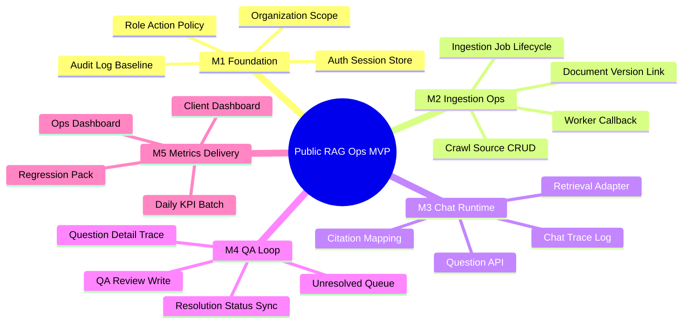
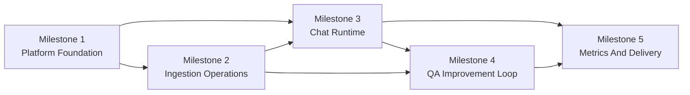
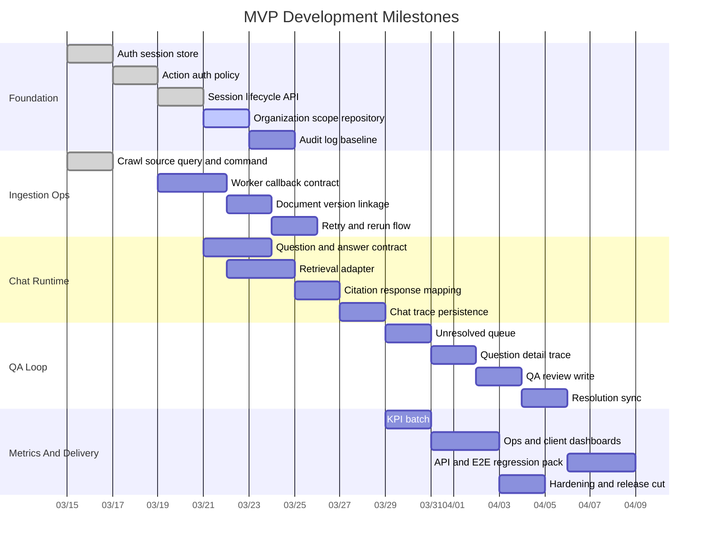

# Development WBS And Milestones

## 1. Purpose

이 문서는 전체 개발 진행을 `중요 단위`, `선행 관계`, `완료 기준`으로 추적하기 위한 WBS다.
상세 API/화면/DB 규약은 기존 문서를 따르고, 이 문서는 `무엇을 어떤 순서로 끝낼지`를 고정한다.

관련 기준 문서:
- [07_delivery_plan.md](/C:/Users/User/Documents/work/mvp_docs/07_delivery_plan.md)
- [08_traceability_matrix.md](/C:/Users/User/Documents/work/mvp_docs/08_traceability_matrix.md)
- [10_auth_authz_api.md](/C:/Users/User/Documents/work/mvp_docs/10_auth_authz_api.md)
- [16_springboot_kotlin_ddd_msa_review.md](/C:/Users/User/Documents/work/mvp_docs/16_springboot_kotlin_ddd_msa_review.md)

## 2. Milestone Overview

### M1. Platform Foundation

- 목표: 관리자 세션, 역할, 조직 범위, 감사 기반을 고정한다.
- 완료 기준: `GET /admin/auth/me`와 권한 검증이 저장소 경계를 통해 동작한다.

### M2. Ingestion Operations

- 목표: crawl source 등록, job 실행, 상태 전이, worker callback 흐름을 닫는다.
- 완료 기준: source 생성부터 job 상태 갱신까지 API와 worker stub이 연결된다.

### M3. Chat Runtime

- 목표: 질문, 답변, retrieval 로그, citation 저장 흐름을 구현한다.
- 완료 기준: chat 요청 단위로 질문, 답변, 검색 근거를 trace할 수 있다.

### M4. QA Improvement Loop

- 목표: unresolved 목록, 상세 추적, QA 판정 저장, 후속 조치 연결을 구현한다.
- 완료 기준: QA 담당자가 검수 후 상태 전이를 완료할 수 있다.

### M5. Metrics And Delivery

- 목표: KPI 집계, 운영 대시보드, 고객사 대시보드, 회귀 테스트 팩을 완성한다.
- 완료 기준: 운영사/고객사가 서로 다른 KPI를 보고 운영 개선 루프를 닫을 수 있다.

## 3. WBS Tree



## 4. Milestone Dependency



## 5. Execution Timeline



## 6. Current Progress Cut (Updated: 2026-03-15)

### ✅ MVP 전체 완성 (2026-03-15)

**Milestone 1: Platform Foundation** ✅ 100%
- ✅ Auth session store (JPA + PostgreSQL)
- ✅ Action auth policy
- ✅ Session lifecycle API (login/logout/me)
- ✅ Organization scope repository
- ✅ Audit log baseline

**Milestone 2: Ingestion Operations** ✅ 100%
- ✅ Crawl source query and command
- ✅ Worker callback contract (Python worker 구현)
- ✅ Ingestion job lifecycle (상태 머신)
- ✅ Document version linkage

**Milestone 3: Chat Runtime** ✅ 100%
- ✅ Question and answer contract
- ✅ Retrieval adapter (RAG orchestrator stub)
- ✅ Citation response mapping
- ✅ Chat trace persistence

**Milestone 4: QA Improvement Loop** ✅ 100%
- ✅ Unresolved queue (Native SQL query)
- ✅ Question detail trace
- ✅ QA review write (상태 머신)
- ✅ Resolution sync

**Milestone 5: Metrics And Delivery** ✅ 80%
- ✅ KPI daily metrics table
- ✅ Metrics API (GET /admin/metrics/daily)
- ⏸️ KPI batch job (미구현)
- ⏸️ Dashboard UI (API만 완성)
- ✅ API and E2E regression pack (39 tests)

### 📊 완성 통계

```
OpenSpec Changes: 18개 (모두 완료)
커밋: 23개
모듈: 7개 Backend + 2개 Python
테이블: 15개 (Flyway V001-V015)
테스트: 39개 (100% passing)
코드: ~7,900줄
```

### 🔄 MVP 핵심 루프 완성

```
시민 질문 → RAG 답변 생성 → Unresolved Queue → QA 검수 → 문서 재수집 → KPI 집계
   ✅           ✅              ✅               ✅           ✅           ✅
```

---

## 7. Production Readiness Phase

### Phase 1: 기술적 완성도 (우선순위 HIGH)

**P1.1 Vector Search 구현** (3-4일)
- [ ] pgvector extension 설정
- [ ] document_chunks 테이블 + embedding vector
- [ ] Embedding 생성 (OpenAI Embeddings API)
- [ ] Vector similarity search
- [ ] RAG orchestrator 실제 retrieval 연동

**P1.2 문서 파싱 파이프라인** (3-4일)
- [ ] HTML 파싱 (Beautiful Soup)
- [ ] PDF 파싱 (pdfplumber)
- [ ] Chunk 생성 (LangChain TextSplitter)
- [ ] Embedding + indexing
- [ ] ingestion-worker 완전 자동화

**P1.3 보안 강화** (2-3일)
- [ ] 비밀번호 bcrypt 해싱
- [ ] Rate limiting (Spring Security)
- [ ] CORS 설정
- [ ] XSS/SQL Injection 방어 검증

**P1.4 로깅 및 모니터링** (2-3일)
- [ ] Logback JSON 포맷
- [ ] request_id, trace_id 자동 생성
- [ ] 모든 API 응답에 request_id 포함
- [ ] Health check 강화
- [ ] 에러 로그 구조화

### Phase 2: 배포 자동화 (우선순위 MEDIUM)

**P2.1 Docker 이미지** (2일)
- [ ] admin-api Dockerfile (멀티스테이지)
- [ ] Python services Dockerfile
- [ ] docker-compose 전체 스택

**P2.2 CI/CD** (2-3일)
- [ ] GitHub Actions workflow
- [ ] 자동 테스트
- [ ] Docker 이미지 빌드
- [ ] 배포 스크립트

### Phase 3: 운영 기능 (우선순위 MEDIUM)

**P3.1 배치 작업** (2-3일)
- [ ] KPI 일배치 집계
- [ ] 세션 만료 정리
- [ ] Audit log 아카이빙

**P3.2 관리자 기능** (2-3일)
- [ ] 사용자 관리 API
- [ ] 역할 할당 API
- [ ] 시스템 설정 API

### Timeline

```
Week 1-2: Vector Search + 문서 파싱
Week 3:   보안 + 로깅
Week 4:   Docker + CI/CD
Week 5-6: 배치 작업 + 통합 테스트

Production 출시: 4-6주 (최소), 8-10주 (안정적)
```

---

## 8. Change Tracking Rule

- Milestone 변경은 `OpenSpec change` 단위로 쪼갠다.
- 하나의 change는 하나의 완료 가능한 단위를 가진다.
- change 완료 후 이 문서의 `Current Progress Cut`과 Gantt 상태를 함께 갱신한다.
- **MVP 완성 이후**: Production phase change는 `PRODUCTION_ROADMAP.md`와 연동한다.
