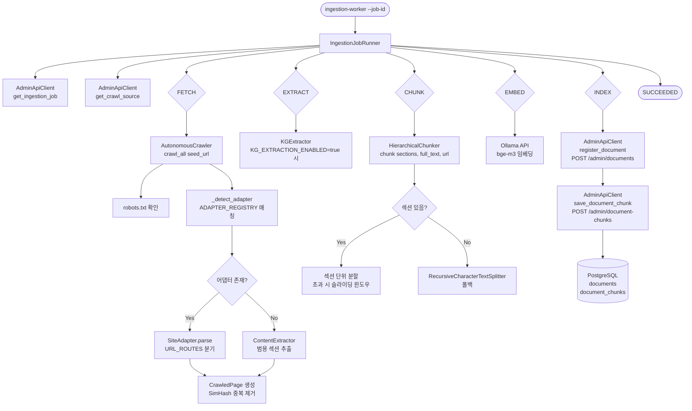
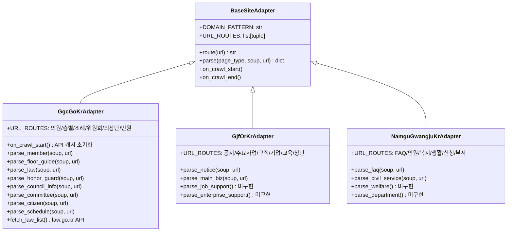
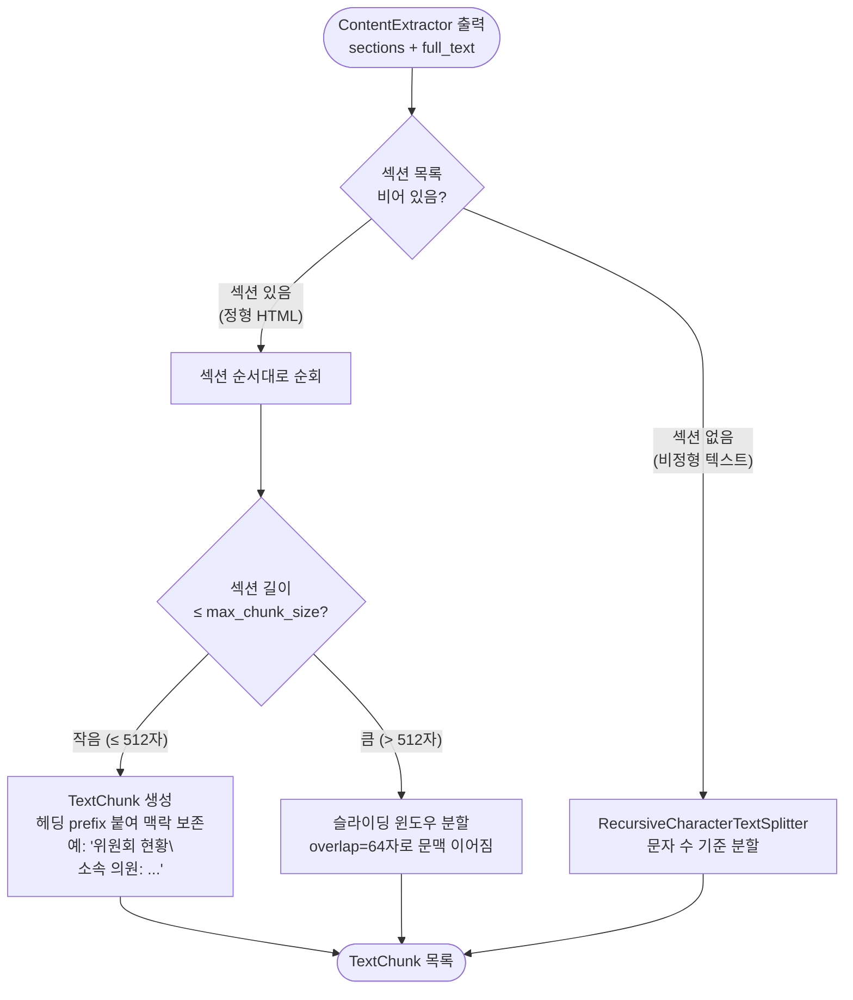
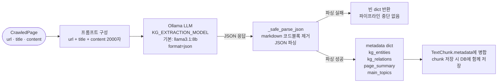

# Ingestion Worker — 크롤러 아키텍처

## 전체 파이프라인



---

## Celery 역할

Celery는 `ingestion-worker`에서 **무거운 ingestion 작업을 백그라운드로 돌리는 실행 계층**이다.

직접 실행 경로와 자동 실행 경로를 분리하면 역할이 명확해진다.

```mermaid
flowchart TD
    A[Admin API] -->|status=queued| B[poll_queued_jobs]
    B --> C[Celery Beat]
    C --> D[Celery Worker]
    D --> E[process_job(job_id)]
    E --> F[IngestionJobRunner.run_job]
    F --> G[(PostgreSQL)]

    H[운영자 직접 실행] --> I[ingestion-worker --job-id]
    I --> F
```

### Celery가 맡는 일

- `Beat`가 5초마다 queued job을 조회한다.
- `process_job(job_id)`로 실제 작업 실행을 위임한다.
- 실패한 job은 최대 3회 재시도한다.
- 이미 처리 중인 job은 중복 투입하지 않도록 필터링한다.

### Celery가 하지 않는 일

- 크롤링 로직 자체를 구현하지 않는다.
- 문서 청킹이나 임베딩 로직을 대신하지 않는다.
- Admin API의 비즈니스 규칙을 변경하지 않는다.
- `IngestionJobRunner.run_job()`의 내부 처리 순서를 바꾸지 않는다.

### 왜 필요한가

- ingestion 작업은 길고 실패 가능성이 높아서 HTTP 요청 스레드에서 직접 처리하면 안 된다.
- 큐 기반으로 분리하면 Admin API는 job 생성만 하고, 실행은 워커가 담당한다.
- Beat + Worker 조합으로 수동 CLI 실행 없이 queued job을 자동 처리할 수 있다.

---

## 패키지 구조

```
python/ingestion-worker/src/ingestion_worker/
│
├── app.py                        # Typer CLI 진입점 (--job-id 옵션)
├── models.py                     # Pydantic 모델: IngestionJob, CrawlSource,
│                                 #   CrawledPage, TextChunk, JobStatus, JobStage
├── admin_api_client.py           # Spring Boot Admin API HTTP 클라이언트
│                                 #   get_ingestion_job / get_crawl_source
│                                 #   transition_job_status / register_document
│                                 #   save_document_chunk
├── job_runner.py                 # 파이프라인 오케스트레이터
│                                 #   FETCH → EXTRACT → CHUNK → EMBED → INDEX
├── kg_extractor.py               # KGExtractor (선택적, KG_EXTRACTION_ENABLED=true)
│                                 #   Ollama LLM → 엔티티·관계·요약·토픽
│
└── crawler/
    ├── __init__.py               # AutonomousCrawler, HierarchicalChunker export
    ├── autonomous.py             # AutonomousCrawler: 멀티페이지 재귀 크롤
    │                             #   SimHash 중복 제거, robots.txt, ADAPTER_REGISTRY
    ├── extractor.py              # ContentExtractor: 범용 HTML 섹션 추출
    │                             #   노이즈 제거, h1~h4 섹션 분리, 내부 링크 수집
    ├── chunker.py                # HierarchicalChunker: 계층형 청킹
    │                             #   섹션 우선 → 슬라이딩 윈도우 → RecursiveSplitter
    │
    └── adapters/
        ├── __init__.py           # 어댑터 export
        ├── base.py               # BaseSiteAdapter: route() / parse() / on_crawl_start()
        ├── ggc_go_kr.py          # 경기도의회 전용 어댑터 (완성)
        ├── gjf_or_kr.py          # 경기도일자리재단 어댑터 (셸, 파서 점진 추가)
        └── namgu_gwangju_kr.py   # 광주남구청 어댑터 (셸, 파서 점진 추가)
```

---

## 핵심 컴포넌트

### 1. AutonomousCrawler (`crawler/autonomous.py`)

URL 하나를 받아 재귀적으로 사이트 전체를 크롤한다.

| 기능 | 설명 |
|------|------|
| 재귀 크롤 | `max_depth` / `max_pages` 제한, BFS 방식 |
| robots.txt 준수 | 각 도메인별 규칙 캐싱 |
| SimHash 중복 제거 | 64-bit SimHash, 해밍 거리 ≤ 3이면 중복으로 판단 |
| Playwright 렌더링 | JS 렌더링 페이지 지원 (`async_playwright`) |
| 어댑터 자동 감지 | `ADAPTER_REGISTRY`에서 도메인 패턴 매칭 |

**ADAPTER_REGISTRY 등록 순서:**
```python
ADAPTER_REGISTRY = [
    (r"ggc\.go\.kr",        GgcGoKrAdapter),       # 경기도의회
    (r"gjf\.or\.kr",        GjfOrKrAdapter),       # 경기도일자리재단
    (r"job\.gg\.go\.kr",    GjfOrKrAdapter),       # 경기도일자리재단 Jobaba
    (r"namgu\.gwangju\.kr", NamguGwangjuKrAdapter),# 광주남구청
]
```

---

### 2. BaseSiteAdapter & 어댑터 패턴



**parse 흐름:**
1. `route(url)` → `URL_ROUTES`를 순서대로 매칭 → `page_type` 반환
2. `parse(page_type, soup, url)` → `parse_{page_type}(soup, url)` 메서드 자동 디스패치
3. 매칭 메서드 없으면 빈 dict 반환 → `ContentExtractor` 범용 추출로 폴백

---

### 3. HierarchicalChunker (`crawler/chunker.py`)

#### 왜 계층형 청킹인가

일반적인 `RecursiveCharacterTextSplitter`는 텍스트를 일정 길이로 자른다. 이 방식은 문서의 **의미 경계**를 무시해서 "3장 2절" 중간이 잘리거나 헤딩과 본문이 다른 청크에 들어가는 문제가 발생한다. RAG 검색 품질이 떨어지는 가장 큰 원인 중 하나다.

`HierarchicalChunker`는 `ContentExtractor`가 이미 추출해 놓은 **섹션 구조**(헤딩 + 본문 쌍)를 활용한다. 섹션 경계 = 의미 경계이므로 청크가 완결된 주제 단위를 보존한다. 섹션이 너무 긴 경우에만 슬라이딩 윈도우로 재분할한다.



**헤딩 prefix의 중요성:** 청크에 헤딩을 붙이는 이유는 벡터 검색 시 문맥이 함께 임베딩되기 때문이다. 예를 들어 "신청 방법은 주민센터 방문입니다"만 있는 것과 "복지카드 재발급 신청 방법\n신청 방법은 주민센터 방문입니다"가 있는 것은 임베딩 공간에서 다른 위치에 놓인다. 후자가 "복지카드 재발급 어디서 하나요?" 쿼리에 더 잘 매칭된다.

**슬라이딩 윈도우의 중첩:** `overlap=64`는 인접 청크가 64자를 공유한다는 의미다. 문장이 청크 경계에서 잘려도 이전·다음 청크에 일부가 포함되므로 검색 시 맥락 단절을 줄인다.

| 파라미터 | 기본값 | 설명 |
|---------|--------|------|
| `max_chunk_size` | 512 | 청크 최대 문자 수. bge-m3 최적 입력 길이 기준 |
| `chunk_overlap` | 64 | 슬라이딩 윈도우 중첩 문자 수. 경계 문맥 보존 |

---

### 4. KGExtractor (`kg_extractor.py`)

#### 왜 KG 추출인가

기본 RAG는 질문과 청크 텍스트의 **표면적 유사도**(벡터 거리)만으로 검색한다. 이 방식은 "경기도의회 예산결산특별위원회 위원장이 누구인가요?"처럼 **엔티티 관계**가 핵심인 질문에 취약하다. 청크 어딘가에 위원장 이름이 있어도, 질문 벡터와 청크 벡터의 거리가 멀면 검색되지 않는다.

KGExtractor는 Ollama LLM을 활용해 각 페이지에서 **엔티티·관계·토픽·요약**을 구조화하여 청크의 `metadata`에 저장한다. 이 메타데이터는 향후 필터링, 그래프 기반 검색, 답변 생성 시 참고 정보로 활용된다.

#### 동작 흐름



#### 추출 결과 예시 (경기도의회 위원회 페이지)

```json
{
  "kg_entities": [
    {"id": "ggc_council",  "type": "Organization", "name": "경기도의회",          "description": "경기도 의정 활동을 담당하는 지방의회"},
    {"id": "budget_cmmt",  "type": "Organization", "name": "예산결산특별위원회",  "description": "예산·결산 심사 담당 위원회"},
    {"id": "kim_chairman", "type": "Person",        "name": "김○○",              "description": "예결특위 위원장"}
  ],
  "kg_relations": [
    {"subject": "budget_cmmt",  "predicate": "IS_PART_OF", "object": "ggc_council",  "weight": 1.0},
    {"subject": "kim_chairman", "predicate": "DESCRIBES",  "object": "budget_cmmt",  "weight": 0.9}
  ],
  "page_summary": "경기도의회 예산결산특별위원회 구성 현황. 위원장 김○○, 소속 의원 12명.",
  "main_topics": ["예산결산", "위원회", "의원 구성"]
}
```

#### 주의사항

- **선택적 활성화**: `KG_EXTRACTION_ENABLED=true`가 없으면 실행되지 않는다. LLM 호출 비용(시간)이 페이지당 2~5초 추가되기 때문이다.
- **실패 내성**: LLM 오류·JSON 파싱 실패 시 빈 dict를 반환하고 파이프라인을 계속 진행한다. KG가 없어도 기본 벡터 검색은 동작한다.
- **재시도**: `tenacity`로 최대 3회 지수 백오프 재시도한다.
- **모델 선택**: 한국어 처리 품질을 위해 `qwen2.5:7b` 또는 `llama3.1:8b` 권장. `KG_EXTRACTION_MODEL` 환경변수로 교체 가능.

---

## 환경변수 요약

| 변수 | 기본값 | 설명 |
|------|--------|------|
| `ADMIN_API_BASE_URL` | `http://localhost:8081` | Spring Boot Admin API |
| `ADMIN_API_SESSION_TOKEN` | — | 인증 세션 토큰 |
| `OLLAMA_URL` | `http://localhost:11434` | Ollama 서버 URL (임베딩) |
| `OLLAMA_EMBED_MODEL` | `bge-m3` | 임베딩 모델 |
| `CRAWLER_MAX_DEPTH` | `3` | 크롤 최대 깊이 |
| `CRAWLER_MAX_PAGES` | `100` | 크롤 최대 페이지 수 |
| `CRAWLER_DELAY` | `1.0` | 페이지 간 지연 (초) |
| `CRAWLER_CONCURRENCY` | `3` | 동시 크롤 수 |
| `KG_EXTRACTION_ENABLED` | `false` | KG 추출 활성화 |
| `KG_EXTRACTION_MODEL` | `llama3.1:8b` | KG 추출용 Ollama 모델 |
| `GGC_MEMBER_API_KEY` | — | 경기도의회 의원 공개 API 키 |
| `LAW_API_KEY` | — | law.go.kr 자치법규 API 키 |

### 실행 전제

- 로컬 워커 검증은 Redis 브로커(`redis://localhost:6379/0`)와 Spring Boot Admin API(`http://localhost:8081`)가 함께 떠 있어야 한다.
- `poll_queued_jobs` 는 Admin API가 내려가 있으면 주기적으로 `Connection refused` 경고를 남기고 다음 주기로 재시도한다.

---

## 새 어댑터 추가 방법

1. `crawler/adapters/` 아래 `{domain}.py` 생성
2. `BaseSiteAdapter` 상속, `DOMAIN_PATTERN`과 `URL_ROUTES` 정의
3. `parse_{page_type}(soup, url)` 메서드 구현
4. `adapters/__init__.py`에 import 추가
5. `autonomous.py`의 `ADAPTER_REGISTRY`에 패턴 등록

```python
# 예시
class MyGovAdapter(BaseSiteAdapter):
    DOMAIN_PATTERN = r"mygov\.go\.kr"
    URL_ROUTES = [
        (r"/faq",    "faq"),
        (r"/notice", "notice"),
    ]

    def parse_faq(self, soup, url):
        ...

# autonomous.py
ADAPTER_REGISTRY = [
    ...
    (r"mygov\.go\.kr", MyGovAdapter),
]
```
